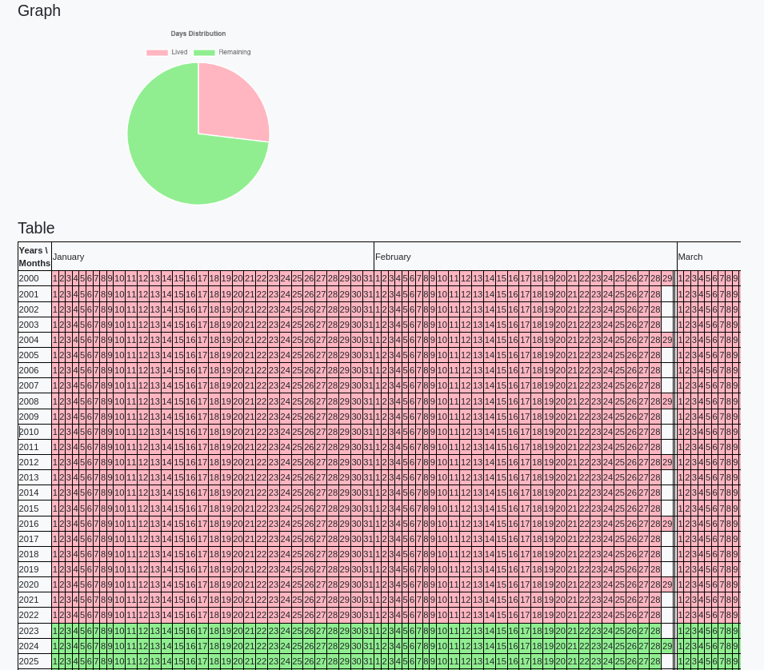

# My life calendar

## Introduction

When I have first seen the [my life calendar]( https://www.ekn.io/calendar/) I was impressed by it. It made me think about how the time just flow without we noticing it. It is a great idea to visualize it so I have decide to make my own version of the life calendar.

## Software and Libraries

This project uses Python 3.9.2 and the following libraries:
* [Django](https://www.djangoproject.com/)

More informations in `requirements.txt`. To create it I have used `python -m pip freeze > requirements.txt`. To install all Python packages written in the requirements.txt file run `pip install -r requirements.txt`.

## Running the code

To run the application `python my_life_calendar_project/manage.py runserver`. The default url to connect to it is http://127.0.0.1:8000/

## Results

The django application 

In the home we can insert the birth date and the life expectancy. By pressing the Submit button we get a table with all the days from the first day of the birth year classified as:
- light grey: days before the birth date and after the expected death date
- light pink: lived days before the current date
- light green: future days until the expected death date 

By clicking the Downlosd button is possible to download the calendar in Excel format

## Acknowledgements

Thanks [my life calendar]( https://www.ekn.io/calendar/) for the ispiration